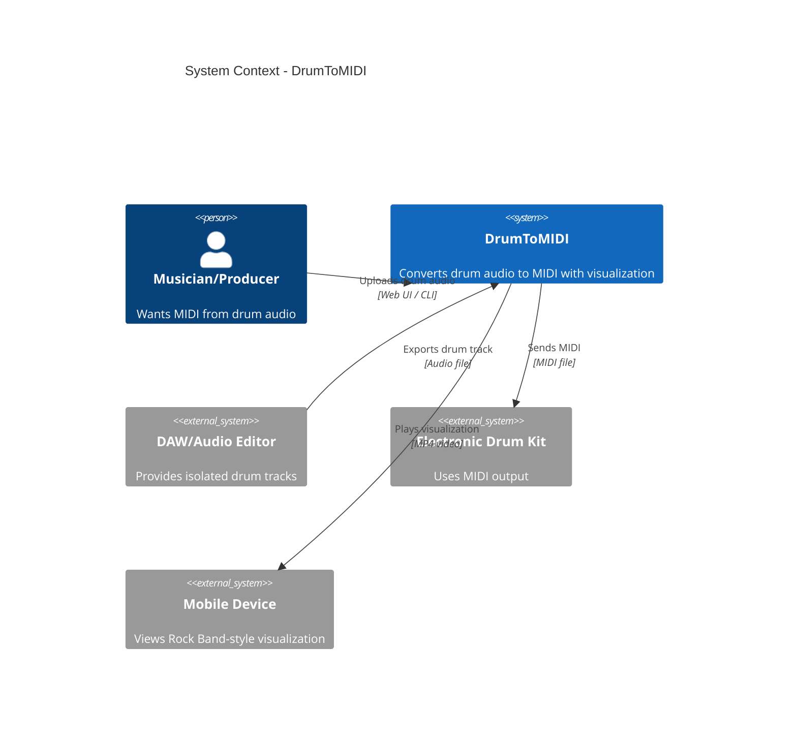

# Architecture Overview

DrumToMIDI is an audio-to-MIDI conversion system for drum tracks using deep learning separation, spectral analysis, and temporal detection.

## System Context (C1)



## User Workflows

### Web UI Workflow
1. User uploads drum audio file (WAV/MP3)
2. System separates into stems (kick, snare, hi-hat, toms, cymbals)
3. Optional: Sidechain cleanup to reduce bleed
4. System converts stems to MIDI
5. Optional: Render visualization video
6. User downloads MIDI + video

### CLI Workflow
1. Place drum track in `user_files/`
2. Run `python separate.py` - creates stems
3. Run `python sidechain_cleanup.py` - reduces bleed (optional)
4. Run `python stems_to_midi_cli.py` - generates MIDI
5. Run `python render_midi_to_video.py` - creates video (optional)

### Docker Workflow
Same as CLI, but inside container:
```bash
docker exec -it DrumToMIDI-midi bash
# Then run CLI commands
```

## Key Capabilities

- **5-stem separation**: Kick, snare, hi-hat, toms, cymbals
- **GPU acceleration**: CUDA (Windows/Linux), Metal/MPS (Mac native)
- **Sidechain cleanup**: Reduces bleed between stems
- **Adaptive detection**: Energy thresholds, spectral analysis
- **Learning mode**: Calibrate thresholds from labeled data
- **Rock Band visualization**: Falling notes with waveforms
- **Web API**: RESTful endpoints for all operations

## Technology Stack

- **Python 3.11**: Core language
- **PyTorch 2.7**: Deep learning (MDX23C model)
- **LibROSA**: Audio analysis
- **ModernGL**: GPU-accelerated rendering (Mac)
- **Flask**: Web UI backend
- **OpenCV**: Video encoding
- **Mido/MidiUtil**: MIDI file handling

## Deployment Options

| Platform | Method | GPU | Performance |
|----------|--------|-----|-------------|
| Mac | Native | MPS | 7x faster than Docker |
| Mac | Docker | None | CPU-only (slow) |
| Windows | Docker + CUDA | NVIDIA | 10-20x speedup |
| Linux | Docker + CUDA | NVIDIA | 10-20x speedup |

## Related Documentation

- [ARCH_C2_CONTAINERS.md](ARCH_C2_CONTAINERS.md) - Container architecture
- [ARCH_C3_COMPONENTS.md](ARCH_C3_COMPONENTS.md) - Code structure
- [ARCH_DATA_FLOW.md](ARCH_DATA_FLOW.md) - Audio processing pipeline
- [ARCH_LAYERS.md](ARCH_LAYERS.md) - Architectural patterns
- [ARCH_FILES.md](ARCH_FILES.md) - File/folder reference
