# Data Flow Architecture

Shows how data transforms through the audio → MIDI → video pipeline.

## Complete Pipeline

```mermaid
graph LR
    A[Drum Audio<br/>WAV/MP3] --> B[Separation<br/>MDX23C Model]
    B --> C[5 Stems<br/>Individual Drums]
    C --> D[Optional:<br/>Sidechain Cleanup]
    D --> E[Onset Detection<br/>Energy + Spectral]
    E --> F[Hit Detections<br/>Time + Velocity]
    F --> G[MIDI Generation<br/>Standard GM Notes]
    G --> H[MIDI File<br/>.mid]
    H --> I[Video Rendering<br/>Rock Band Style]
    I --> J[MP4 Video<br/>Falling Notes]
    
    style B fill:#ffecb3
    style E fill:#ffecb3
    style G fill:#ffecb3
    style I fill:#ffecb3
```



**Legend**: Yellow = Processing stages

## Stage 1: Stem Separation

### Input
```
drum_audio.wav (stereo, 44.1kHz)
├── Size: ~50MB for 5-minute track
└── Format: WAV, MP3, FLAC
```

### Processing
```python
# separation_shell.py
1. Load audio with torchaudio
2. Resample to model's expected rate (44.1kHz)
3. Run MDX23C inference:
   - Feed audio through U-Net architecture
   - Predict masks for 5 stems
   - Apply masks to original audio
4. Save separated stems
```

### Output
```
separated_stems/
├── kick.wav       # Bass drum
├── snare.wav      # Snare drum
├── hihat.wav      # Hi-hat (open + closed)
├── toms.wav       # Tom drums (3 drums, mixed)
└── cymbals.wav    # Crash, ride cymbals
```

**Characteristics**:
- Each stem: mono, 44.1kHz, 32-bit float
- File size: ~10MB each (5min track)
- Processing time: 38s (Mac MPS), 777s (Docker CPU)

## Stage 2: Sidechain Cleanup (Optional)

### Input
```python
{
    'kick': kick_audio,    # numpy array
    'snare': snare_audio   # numpy array
}
```

### Processing
```python
# sidechain_shell.py
1. Detect snare hits (loud transients)
2. For each snare hit:
   - Calculate attack/decay window
   - Apply envelope to reduce kick volume
   - Smooth transition with fade curves
3. Reconstruct cleaned kick stem
```

### Output
```
kick_cleaned.wav  # Kick with snare bleed removed
```

**Purpose**: Remove acoustic bleed (snare leaking into kick mic)

## Stage 3: Onset Detection

### Input (Per Stem)
```python
audio: np.ndarray    # Shape: (samples,)
sr: int = 44100      # Sample rate
config: Config       # Detection thresholds
```

### Processing Flow

#### 3.1 Energy Analysis
```python
# stems_to_midi/helpers.py
1. Calculate RMS energy in sliding windows (512 samples)
2. Find peaks above threshold
3. Validate minimum time between hits (50ms)
```

#### 3.2 Spectral Analysis
```python
# stems_to_midi/detection.py
1. Compute STFT (Short-Time Fourier Transform)
2. Analyze frequency bins:
   - Kick: 50-100 Hz
   - Snare: 200-500 Hz, 2-4 kHz
   - Hi-hat: 8-12 kHz
   - Toms: 80-120 Hz, 150-250 Hz, 200-400 Hz
   - Cymbals: 5-10 kHz
3. Peak detection in target bins
```

#### 3.3 Hi-Hat Classification
```python
# stems_to_midi/detection.py
1. Extract spectral centroid
2. Calculate energy in high frequencies (>10kHz)
3. Classify: open (bright) vs closed (dark)
```

#### 3.4 Tom Pitch Estimation
```python
# stems_to_midi/helpers.py
1. Group tom hits by spectral similarity
2. Assign to 3 pitch classes (low, mid, high)
3. Map to MIDI notes: F1, A1, D2
```

#### 3.5 Velocity Estimation
```python
# stems_to_midi/detection.py
1. Measure peak amplitude at onset
2. Normalize to 0-127 range
3. Apply velocity curve (power law)
```

### Output (Per Stem)
```python
[
    Detection(time=0.234, velocity=95, note='kick'),
    Detection(time=0.467, velocity=82, note='kick'),
    Detection(time=0.701, velocity=88, note='snare'),
    ...
]
```

## Stage 4: MIDI Generation

### Input
```python
detections: Dict[str, List[Detection]] = {
    'kick': [Detection(...), ...],
    'snare': [Detection(...), ...],
    'hihat_closed': [Detection(...), ...],
    'hihat_open': [Detection(...), ...],
    'tom_low': [Detection(...), ...],
    'tom_mid': [Detection(...), ...],
    'tom_high': [Detection(...), ...],
    'crash': [Detection(...), ...],
    'ride': [Detection(...), ...],
}
bpm: float = 120.0
```

### Processing
```python
# stems_to_midi/midi.py
1. Create MIDI file with single track (channel 10 = drums)
2. Map drum types to GM notes:
   - Kick: C1 (note 36)
   - Snare: D1 (note 38)
   - Hi-hat closed: F#1 (note 42)
   - Hi-hat open: A#1 (note 46)
   - Tom low: F1 (note 41)
   - Tom mid: A1 (note 45)
   - Tom high: D2 (note 50)
   - Crash: C#2 (note 49)
   - Ride: D#2 (note 51)
3. For each detection:
   - Convert time to MIDI ticks
   - Create note-on + note-off events
   - Set velocity from detection
4. Write MIDI file
```

### Output
```
output.mid
├── Format: 1 (single track)
├── Division: 480 ticks per quarter note
├── Tempo: Based on input BPM
└── Channel: 10 (GM drums)
```

**MIDI Note Mapping**:
```
C1  (36) = Kick
D1  (38) = Snare
F#1 (42) = Hi-hat closed
A#1 (46) = Hi-hat open
F1  (41) = Tom low
A1  (45) = Tom mid
D2  (50) = Tom high
C#2 (49) = Crash
D#2 (51) = Ride
```

## Stage 5: Video Rendering

### Input
```python
midi_file: Path          # MIDI file from stage 4
audio_file: Path         # Original or custom audio
config: dict = {
    'resolution': (1920, 1080),
    'fps': 60,
    'note_height': 80,
    'fall_time': 2.0,    # Seconds of note fall
}
```

### Processing Flow

#### 5.1 Parse MIDI
```python
# midi_parser.py
1. Read MIDI file
2. Extract note events (on/off pairs)
3. Convert to internal representation:
   MidiNote(start_time, duration, pitch, velocity)
```

#### 5.2 Calculate Layout
```python
# midi_render_core.py
1. Assign horizontal lanes (one per drum type)
2. Calculate vertical positions:
   - y = (current_time - note.start_time) * pixels_per_second
3. Apply perspective effect (optional)
4. Calculate colors by velocity
```

#### 5.3 Render Frames (GPU Path)
```python
# moderngl_renderer/shell.py
For each frame (1/60 second):
  1. Create OpenGL context
  2. Render background
  3. Render note highway (falling grid)
  4. Render active notes (rectangles)
  5. Render waveform overlay (optional)
  6. Render text overlays (song info)
  7. Read framebuffer to numpy array
  8. Encode frame to video
```

#### 5.4 Render Frames (CPU Fallback)
```python
# render_midi_video_shell.py (legacy)
For each frame:
  1. Create PIL Image
  2. Draw background
  3. Draw notes with PIL.Draw
  4. Save frame to OpenCV
  5. Encode frame to video
```

### Output
```
output.mp4
├── Resolution: 1920x1080 (configurable)
├── FPS: 60 (configurable)
├── Codec: H.264
├── Audio: AAC (from input or custom)
└── Duration: Matches MIDI length
```

**Rendering Performance**:
- GPU (ModernGL): 1.7-2x real-time
- CPU (PIL): 0.3-0.5x real-time

## Data Transformations Summary

| Stage | Input | Output | Size | Time |
|-------|-------|--------|------|------|
| Separation | 50MB WAV | 5x 10MB stems | 50MB | 38s (MPS) |
| Cleanup | 10MB stem | 10MB stem | 10MB | 2s |
| Detection | 10MB stem | ~200 detections | <1KB | 1s |
| MIDI Gen | 1KB detections | 10KB MIDI | 10KB | <1s |
| Rendering | 10KB MIDI | 500MB MP4 | 500MB | 120s (GPU) |

## Configuration Files

### `config.yaml` (Project-level)
```yaml
bpm: 120.0
time_signature: "4/4"
use_sidechain_cleanup: true
```

### `midiconfig.yaml` (Detection thresholds)
```yaml
drums:
  kick:
    energy_threshold: 0.02
    min_time_between_hits: 0.05
  snare:
    energy_threshold: 0.015
    frequency_bins: [200, 500, 2000, 4000]
  hihat:
    energy_threshold: 0.01
    spectral_centroid_threshold: 8000
```

### `webui/settings.yaml` (Rendering config)
```yaml
video:
  resolution: [1920, 1080]
  fps: 60
  note_height: 80
  fall_time: 2.0
```

## Error Handling

### Separation Failures
- Model loading errors → Fallback to CPU
- Out of memory → Process in smaller chunks
- Invalid audio format → Convert with ffmpeg

### Detection Failures
- No onsets detected → Lower thresholds
- Too many false positives → Raise thresholds
- Learning mode available for calibration

### Rendering Failures
- GPU not available → Fallback to CPU rendering
- Out of memory → Reduce resolution
- Encoding errors → Try different codec

## Related Documentation

- [ARCH_C1_OVERVIEW.md](ARCH_C1_OVERVIEW.md) - System context
- [ARCH_C2_CONTAINERS.md](ARCH_C2_CONTAINERS.md) - Application architecture
- [ARCH_C3_COMPONENTS.md](ARCH_C3_COMPONENTS.md) - Code structure
- [docs/STEMS_TO_MIDI_GUIDE.md](docs/STEMS_TO_MIDI_GUIDE.md) - Detection details
- [docs/MIDI_VISUALIZATION_GUIDE.md](docs/MIDI_VISUALIZATION_GUIDE.md) - Rendering details
