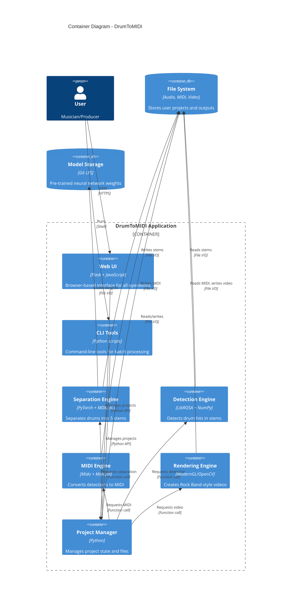

# Container Architecture (C2)

Shows the major application containers and how they interact.

## Container Diagram



## Container Responsibilities

### Web UI (`webui/`)
- **Role**: HTTP API + browser interface
- **Tech**: Flask, JavaScript, HTML/CSS
- **Responsibilities**:
  - Project management (create, list, delete)
  - File uploads
  - Operation orchestration (separate, convert, render)
  - Job status tracking
  - Configuration management
  - File downloads

### CLI Tools (Root scripts)
- **Role**: Command-line batch processing
- **Scripts**:
  - `separate.py` - Stem separation
  - `sidechain_cleanup.py` - Bleed reduction
  - `stems_to_midi_cli.py` - MIDI conversion
  - `render_midi_to_video.py` - Video rendering
- **Responsibilities**:
  - Single-operation focus
  - Progress reporting
  - Error handling

### Separation Engine (`separation_shell.py`, `mdx23c_*`)
- **Role**: Audio source separation
- **Tech**: PyTorch, MDX23C model, torchaudio
- **Responsibilities**:
  - Load pre-trained model
  - Split audio into 5 stems
  - GPU acceleration (CUDA/MPS)
  - Chunk-based processing

### Detection Engine (`stems_to_midi/detection.py`, `helpers.py`)
- **Role**: Drum hit detection
- **Tech**: LibROSA, NumPy, SciPy
- **Responsibilities**:
  - Onset detection (energy thresholds)
  - Spectral analysis (frequency bins)
  - Hi-hat state classification (open/closed)
  - Tom pitch estimation
  - Velocity estimation

### MIDI Engine (`stems_to_midi/midi.py`, `midi_core.py`)
- **Role**: MIDI file generation
- **Tech**: Mido, MidiUtil
- **Responsibilities**:
  - Convert detections to MIDI events
  - Map drums to standard GM notes
  - Apply timing quantization
  - Write MIDI files

### Rendering Engine (`moderngl_renderer/`, `render_midi_video_shell.py`)
- **Role**: Video visualization
- **Tech**: ModernGL (GPU), OpenCV (fallback)
- **Responsibilities**:
  - Parse MIDI events
  - Render falling notes (Rock Band style)
  - Overlay waveforms
  - GPU-accelerated compositing
  - MP4 encoding

### Project Manager (`project_manager.py`)
- **Role**: State management
- **Tech**: Pure Python, YAML
- **Responsibilities**:
  - Project folder structure
  - File path resolution
  - Configuration persistence
  - Orchestration helpers

## Deployment Containers

### Docker Container
```
FROM pytorch/pytorch:2.5.1-cuda12.4-cudnn9-runtime
- Conda environment (larsnet-midi)
- All Python dependencies
- GPU support (NVIDIA only)
- Volume mount: /app
- Port: 4915 (Web UI)
```

### Native Installation
```
- Miniforge/Conda environment
- PyTorch with MPS (Mac) or CUDA (Windows/Linux)
- Direct GPU access
- Better performance than Docker
```

## Communication Patterns

### Web UI Flow
```
Browser → Flask Route → API Handler → Project Manager → Engine → File System
```

### CLI Flow
```
Shell → Python Script → Engine → File System
```

### Engine Dependencies
```
Separation Engine ← MDX23C Model (1.1GB)
Detection Engine ← Audio Stems (generated)
MIDI Engine ← Detections (in-memory)
Rendering Engine ← MIDI File (generated)
```

## Related Documentation

- [ARCH_C1_OVERVIEW.md](ARCH_C1_OVERVIEW.md) - System context
- [ARCH_C3_COMPONENTS.md](ARCH_C3_COMPONENTS.md) - Code modules
- [ARCH_DATA_FLOW.md](ARCH_DATA_FLOW.md) - Processing pipeline
