# Component Architecture (C3)

Shows the code-level structure: packages, modules, and their dependencies.

## Component Diagram

```mermaid
graph TB
    subgraph "Web Application"
        webui_app[webui/app.py<br/>Flask Application]
        webui_api[webui/api/*<br/>REST Endpoints]
        webui_config[webui/config_engine.py<br/>Settings Management]
        webui_jobs[webui/jobs.py<br/>Background Tasks]
    end
    
    subgraph "Separation Pipeline"
        sep_shell[separation_shell.py<br/>Audio Separation]
        mdx23c[mdx23c_optimized.py<br/>MDX23C Model]
        mdx_utils[mdx23c_utils.py<br/>Model Loading]
        device[device_shell.py<br/>GPU Management]
    end
    
    subgraph "Stems to MIDI Pipeline"
        processor[stems_to_midi/processor.py<br/>Orchestrator]
        detection[stems_to_midi/detection.py<br/>Hit Detection]
        helpers[stems_to_midi/helpers.py<br/>Analysis Utilities]
        learning[stems_to_midi/learning.py<br/>Threshold Learning]
        midi_gen[stems_to_midi/midi.py<br/>MIDI Generation]
        config_stems[stems_to_midi/config.py<br/>Configuration]
    end
    
    subgraph "MIDI Core"
        midi_types[midi_types.py<br/>Type Contracts]
        midi_parser[midi_parser.py<br/>MIDI Parsing]
        midi_core[midi_core.py<br/>MIDI Operations]
        midi_shell[midi_shell.py<br/>File I/O]
    end
    
    subgraph "Video Rendering"
        render_shell[render_midi_video_shell.py<br/>Rendering Shell]
        render_core[render_video_core.py<br/>Drawing Core]
        midi_render_core[midi_render_core.py<br/>Layout Logic]
        moderngl_shell[moderngl_renderer/shell.py<br/>GPU Orchestration]
        moderngl_core[moderngl_renderer/core.py<br/>GPU Primitives]
        animation[moderngl_renderer/animation.py<br/>Animations]
    end
    
    subgraph "Audio Processing"
        sidechain_shell[sidechain_shell.py<br/>Bleed Cleanup Shell]
        sidechain_core[sidechain_core.py<br/>Compression Core]
    end
    
    subgraph "Project Management"
        project_mgr[project_manager.py<br/>State Management]
    end
    
    subgraph "CLI Scripts"
        separate_cli[separate.py]
        sidechain_cli[sidechain_cleanup.py]
        stems_cli[stems_to_midi_cli.py]
        render_cli[render_midi_to_video.py]
    end
    
    %% Web UI Dependencies
    webui_app --> webui_api
    webui_app --> webui_config
    webui_api --> webui_jobs
    webui_api --> project_mgr
    webui_jobs --> sep_shell
    webui_jobs --> processor
    webui_jobs --> render_shell
    
    %% CLI Dependencies
    separate_cli --> sep_shell
    sidechain_cli --> project_mgr
    stems_cli --> processor
    render_cli --> render_shell
    
    %% Separation Dependencies
    sep_shell --> mdx23c
    sep_shell --> device
    mdx23c --> mdx_utils
    mdx_utils --> device
    
    %% Stems to MIDI Dependencies
    processor --> detection
    processor --> helpers
    processor --> learning
    processor --> midi_gen
    processor --> config_stems
    detection --> helpers
    midi_gen --> midi_core
    
    %% MIDI Core Dependencies
    midi_core --> midi_types
    midi_parser --> midi_types
    midi_shell --> midi_core
    midi_shell --> midi_parser
    
    %% Rendering Dependencies
    render_shell --> render_core
    render_shell --> midi_shell
    render_shell --> midi_render_core
    render_shell --> moderngl_shell
    moderngl_shell --> moderngl_core
    moderngl_shell --> animation
    midi_render_core --> midi_types
    
    %% Audio Processing Dependencies
    sidechain_shell --> sidechain_core
    
    %% Project Manager Dependencies
    project_mgr --> config_stems
    
    style midi_types fill:#e1f5fe
    style midi_core fill:#e1f5fe
    style midi_parser fill:#e1f5fe
    style midi_render_core fill:#e1f5fe
    style render_core fill:#e1f5fe
    style sidechain_core fill:#e1f5fe
    style moderngl_core fill:#e1f5fe
    style detection fill:#e1f5fe
    style helpers fill:#e1f5fe
```



**Legend**: Blue = Functional cores (pure logic, well-tested)

## Package Structure

### `webui/` - Web Application
```
webui/
├── app.py                      # Flask application entry point
├── config.py                   # Flask configuration
├── config_engine.py            # Settings management (91% coverage)
├── config_schema.py            # Settings validation
├── jobs.py                     # Background job management
├── api/                        # REST API endpoints
│   ├── config.py              # Settings API
│   ├── downloads.py           # File downloads
│   ├── job_status.py          # Job tracking
│   ├── operations.py          # Separation/conversion ops
│   ├── projects.py            # Project CRUD
│   └── upload.py              # File uploads
├── static/                     # Frontend assets
│   ├── css/
│   ├── js/
│   └── img/
└── templates/                  # HTML templates
    └── index.html
```

### `stems_to_midi/` - Detection & Conversion
```
stems_to_midi/
├── __init__.py
├── config.py                   # Configuration dataclass (92% coverage)
├── detection.py                # Hit detection (91% coverage)
├── helpers.py                  # Analysis utilities (66% coverage)
├── learning.py                 # Threshold calibration (95% coverage)
├── midi.py                     # MIDI generation (100% coverage)
├── processor.py                # Main orchestrator (65% coverage)
└── optimization/               # CLI tool for threshold tuning
    ├── extract_features.py
    └── optimize.py
```

### `moderngl_renderer/` - GPU Rendering
```
moderngl_renderer/
├── __init__.py
├── animation.py                # Animation curves (98% coverage)
├── core.py                     # GPU primitives (100% coverage)
├── midi_animation.py           # MIDI-specific animations (94%)
├── midi_video_core.py          # Video layout (58% coverage)
├── midi_video_shell.py         # GPU rendering shell (9%)
├── shell.py                    # Rendering orchestration (62%)
└── text_overlay_shell.py       # Text rendering (12%)
```

### Root Modules

#### MIDI System
- `midi_types.py` (95%) - Type contracts (MidiNote, MidiEvent, etc.)
- `midi_parser.py` (100%) - Parse MIDI files
- `midi_core.py` (78%) - MIDI operations (functional core)
- `midi_shell.py` (78%) - File I/O (imperative shell)
- `midi_render_core.py` (100%) - Layout logic (functional core)

#### Separation System
- `separation_shell.py` (8%) - Audio separation (imperative shell)
- `mdx23c_optimized.py` (11%) - MDX23C model inference
- `mdx23c_utils.py` (47%) - Model loading utilities
- `device_shell.py` (8%) - GPU management (imperative shell)

#### Video Rendering
- `render_video_core.py` (100%) - Drawing primitives (functional core)
- `render_midi_video_shell.py` (15%) - Video rendering orchestration (shell)

#### Audio Processing
- `sidechain_core.py` (100%) - Compression algorithms (functional core)
- `sidechain_shell.py` (19%) - Bleed reduction orchestration (shell)

#### Supporting Modules
- `project_manager.py` (68%) - Project state management

#### CLI Scripts
- `separate.py` (0%) - Stem separation CLI
- `sidechain_cleanup.py` - Bleed reduction CLI
- `stems_to_midi_cli.py` (0%) - MIDI conversion CLI
- `render_midi_to_video.py` - Video rendering CLI

## Key Interfaces

### Audio Processing
```python
# separation_shell.py
def separate_drums(audio_path: str, output_dir: str, device: str) -> Dict[str, str]
    """Returns: {'kick': path, 'snare': path, ...}"""
```

### Detection
```python
# stems_to_midi/detection.py
def detect_drum_hits(audio: np.ndarray, sr: int, config: Config) -> List[Detection]
    """Returns: List of (time, velocity, confidence)"""
```

### MIDI Generation
```python
# stems_to_midi/midi.py
def create_midi_from_detections(detections: Dict[str, List], bpm: float) -> MidiFile
```

### Rendering
```python
# moderngl_renderer/shell.py
def render_video(midi_path: str, audio_path: str, output_path: str, config: dict)
```

## Dependency Rules

### Functional Core → Imperative Shell Pattern

**Cores (Pure Logic)**:
- `midi_core.py` - MIDI operations
- `midi_render_core.py` - Layout calculations
- `moderngl_renderer/core.py` - GPU primitives
- `stems_to_midi/detection.py` - Hit detection
- `stems_to_midi/helpers.py` - Analysis functions

**Shells (Side Effects)**:
- `midi_shell.py` - File I/O
- `separation_shell.py` - Audio processing
- `device_shell.py` - GPU management
- `render_midi_video_shell.py` - Video encoding
- CLI scripts

**Rule**: Shells call cores, cores never call shells. Cores should be pure functions testable without I/O.

### Package Boundaries

- `webui/` may import any module (top-level orchestrator)
- `stems_to_midi/` is self-contained (no external package deps)
- `moderngl_renderer/` is self-contained
- MIDI modules (`midi_*.py`) form a shared library
- CLI scripts import but don't export

## Test Coverage by Component

| Component | Coverage | Type |
|-----------|----------|------|
| midi_types.py | 95% | Core |
| midi_parser.py | 100% | Core |
| midi_core.py | 78% | Core |
| midi_render_core.py | 100% | Core |
| moderngl_renderer/core.py | 100% | Core |
| stems_to_midi/detection.py | 91% | Core |
| stems_to_midi/midi.py | 100% | Core |
| separation_shell.py | 8% | Shell |
| device_shell.py | 8% | Shell |
| render_midi_video_shell.py | 15% | Shell |

**Pattern**: Functional cores have 80-100% coverage. Imperative shells have low coverage (tested via integration tests).

## Related Documentation

- [ARCH_C1_OVERVIEW.md](ARCH_C1_OVERVIEW.md) - System context
- [ARCH_C2_CONTAINERS.md](ARCH_C2_CONTAINERS.md) - Application containers
- [ARCH_DATA_FLOW.md](ARCH_DATA_FLOW.md) - Processing pipeline
- [ARCH_LAYERS.md](ARCH_LAYERS.md) - Architectural patterns
