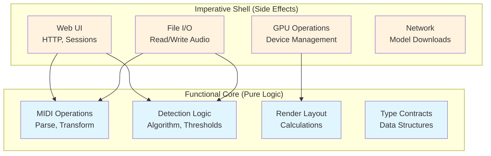

# Architectural Layers

Documents the "functional core, imperative shell" pattern used throughout the codebase.

## Pattern Overview



**Rule**: Shells call cores, cores never call shells. Cores are pure, testable, deterministic.

## Functional Cores (Pure Logic)

### Characteristics
- **No side effects**: No file I/O, network, database, system calls
- **Deterministic**: Same input always produces same output
- **Testable**: Unit tests without mocks, fast execution
- **Portable**: Can run anywhere, no environment dependencies

### Core Modules

#### MIDI Core (`midi_core.py`) - 78% coverage
```python
# Pure functions for MIDI manipulation
def parse_midi_events(data: bytes) -> List[MidiEvent]:
    """Parse raw MIDI bytes into structured events"""
    
def transpose_notes(events: List[MidiEvent], semitones: int) -> List[MidiEvent]:
    """Transpose all note events"""
    
def quantize_timing(events: List[MidiEvent], grid: float) -> List[MidiEvent]:
    """Snap events to timing grid"""
```

**Why pure?**
- No file access (receives bytes, returns data)
- Easily testable with various MIDI patterns
- Can be reused in CLI, web UI, batch processing

#### MIDI Render Core (`midi_render_core.py`) - 100% coverage
```python
def calculate_note_positions(
    notes: List[MidiNote],
    current_time: float,
    config: LayoutConfig
) -> List[NotePosition]:
    """Calculate screen positions for falling notes"""
    
def apply_perspective(
    positions: List[NotePosition],
    vanishing_point: Tuple[float, float]
) -> List[NotePosition]:
    """Apply perspective transformation"""
```

**Why pure?**
- Mathematical calculations only
- Easy to verify correctness
- Performance optimizations don't change behavior

#### Detection Core (`stems_to_midi/detection.py`) - 91% coverage
```python
def detect_onsets(
    audio: np.ndarray,
    sr: int,
    threshold: float
) -> List[float]:
    """Find onset times in audio signal"""
    
def classify_hihat_state(
    spectral_features: np.ndarray
) -> Literal['open', 'closed']:
    """Classify hi-hat as open or closed"""
```

**Why pure?**
- Signal processing algorithms
- Testable with synthetic audio
- Threshold tuning via unit tests

#### Type Contracts (`midi_types.py`) - 95% coverage
```python
@dataclass(frozen=True)
class MidiNote:
    start_time: float
    duration: float
    pitch: int
    velocity: int
    channel: int = 0
    
    def __post_init__(self):
        """Validate invariants"""
        if not 0 <= self.pitch <= 127:
            raise ValueError("Invalid MIDI pitch")
```

**Why frozen dataclasses?**
- Immutable by default
- Type checking with mypy
- Clear contracts between modules

#### Sidechain Core (`sidechain_core.py`) - 100% coverage
```python
def envelope_follower(
    audio: np.ndarray,
    sr: int,
    attack_ms: float,
    release_ms: float
) -> np.ndarray:
    """Track audio envelope with attack/release"""
    
def calculate_gain_reduction_db(
    sidechain_db: np.ndarray,
    threshold: float,
    ratio: float,
    knee: float
) -> np.ndarray:
    """Calculate compression gain reduction curve"""
    
def sidechain_compress(
    main: np.ndarray,
    sidechain: np.ndarray,
    sr: int,
    threshold: float,
    ratio: float,
    attack_ms: float,
    release_ms: float,
    knee: float,
    makeup_gain_db: float
) -> Tuple[np.ndarray, Dict[str, float]]:
    """Pure sidechain compression with stats"""
```

**Why pure?**
- Numerical DSP algorithms
- Testable with synthetic signals
- No audio file I/O needed
- Deterministic behavior
- Fast unit tests

#### Render Video Core (`render_video_core.py`) - 100% coverage
```python
def pil_to_cv2(pil_image: Image.Image) -> np.ndarray:
    """Convert PIL Image to OpenCV array with alpha compositing"""
    
def cv2_to_pil(cv2_image: np.ndarray) -> Image.Image:
    """Convert OpenCV array to PIL Image"""
    
def cv2_draw_rounded_rectangle(
    canvas: np.ndarray,
    xy: Tuple[int, int, int, int],
    radius: int,
    fill: Optional[Tuple[int, int, int]] = None,
    outline: Optional[Tuple[int, int, int]] = None,
    width: int = 1
) -> None:
    """Draw rounded rectangle on canvas (mutates in-place for performance)"""
    
def cv2_composite_layer(
    base: np.ndarray,
    overlay: np.ndarray,
    alpha: float = 1.0
) -> None:
    """Alpha blend overlay onto base (mutates in-place)"""
```

**Why pure (with controlled mutation)?**
- Image format conversions are deterministic
- Drawing operations testable with synthetic canvases
- No GPU/OpenGL context needed
- In-place mutation for performance (functional core with optimization)
- No file I/O dependencies

### Testing Functional Cores

```python
# test_midi_core.py
def test_transpose_notes():
    events = [MidiEvent(note=60, ...)]
    result = transpose_notes(events, semitones=12)
    assert result[0].note == 72  # No mocks, just math
    
def test_quantize_timing():
    events = [MidiEvent(time=0.123, ...)]
    result = quantize_timing(events, grid=0.25)
    assert result[0].time == 0.125  # Deterministic
```

**Benefits**:
- Fast (no I/O waits)
- No setup/teardown
- No flaky tests
- Easy to add edge cases

## Imperative Shells (Side Effects)

### Characteristics
- **Side effects**: File I/O, network, GPU, database
- **Non-deterministic**: Depends on external state
- **Integration tests**: Tested via higher-level scenarios
- **Environment-dependent**: Requires GPU, files, network

### Shell Modules

#### Separation Shell (`separation_shell.py`) - 8% coverage
```python
def separate_audio_file(
    input_path: str,
    output_dir: str,
    device: str = 'cuda'
) -> Dict[str, str]:
    """
    Side effects:
    - Read audio file
    - Load neural network weights
    - Allocate GPU memory
    - Write 5 output files
    - Log progress to console
    """
    audio, sr = torchaudio.load(input_path)  # I/O
    model = load_model(device)                # GPU
    stems = model(audio)                      # Computation
    for name, stem in stems.items():
        save_audio(stem, f"{output_dir}/{name}.wav")  # I/O
    return {name: path for name, path in ...}
```

**Why shell?**
- Orchestrates I/O and GPU operations
- Low unit test coverage acceptable (8%)
- Tested via integration tests

#### Sidechain Shell (`sidechain_shell.py`) - 19% coverage
```python
from sidechain_core import sidechain_compress as _sidechain_compress

def process_sidechain_cleanup(
    main_path: str,
    sidechain_path: str,
    output_path: str,
    params: SidechainParams
) -> None:
    """
    Side effects:
    - Read two audio files
    - Log progress to console
    - Write processed audio file
    """
    # IMPERATIVE: Load files
    main_audio, sr = soundfile.read(main_path)
    sidechain_audio, _ = soundfile.read(sidechain_path)
    
    # FUNCTIONAL: Process with pure function
    compressed, stats = _sidechain_compress(
        main=main_audio,
        sidechain=sidechain_audio,
        sr=sr,
        **params
    )
    
    # IMPERATIVE: Save and log
    soundfile.write(output_path, compressed, sr)
    print(f"✓ Reduced by {stats['avg_reduction_db']:.1f}dB")
```

**Why shell?**
- File I/O orchestration
- Console logging for user feedback
- Thin wrapper around pure core
- Low coverage expected (19%)

#### Render Video Shell (`render_midi_video_shell.py`) - 15% coverage
```python
from render_video_core import (
    pil_to_cv2 as _pil_to_cv2,
    cv2_draw_rounded_rectangle as _cv2_draw_rounded_rectangle,
    cv2_composite_layer as _cv2_composite_layer
)

class MidiVideoRenderer:
    def render_frame(self, time: float) -> np.ndarray:
        """
        Side effects:
        - FFmpeg subprocess management
        - GPU OpenGL rendering
        - Preview window display
        """
        # IMPERATIVE: Allocate resources
        canvas = self._allocate_canvas()  # GPU/memory
        
        # FUNCTIONAL: Draw with pure functions
        _cv2_draw_rounded_rectangle(canvas, (10, 10, 100, 50), 5, fill=(255, 0, 0))
        overlay = self._create_overlay()
        _cv2_composite_layer(canvas, overlay, alpha=0.8)
        
        # IMPERATIVE: Write to FFmpeg
        self.ffmpeg_process.stdin.write(canvas.tobytes())  # I/O
        
        # IMPERATIVE: Update preview
        if self.show_preview:
            cv2.imshow('Preview', canvas)  # GUI
        
        return canvas
```

**Why shell?**
- FFmpeg process orchestration
- OpenGL context management
- Window display
- File I/O for video output
- Low coverage expected (15%)

#### MIDI Shell (`midi_shell.py`) - 78% coverage
```python
def load_midi_file(path: str) -> MidiFile:
    """
    Side effects:
    - Read file from disk
    - Parse using core functions
    """
    with open(path, 'rb') as f:
        data = f.read()  # Side effect
    return parse_midi_events(data)  # Pure core
    
def save_midi_file(midi: MidiFile, path: str):
    """
    Side effects:
    - Write file to disk
    """
    data = serialize_midi(midi)  # Pure core
    with open(path, 'wb') as f:
        f.write(data)  # Side effect
```

**Pattern**: Thin wrapper around core, handles I/O only

#### Device Shell (`device_shell.py`) - 8% coverage
```python
def get_available_device() -> str:
    """
    Side effects:
    - Query CUDA availability
    - Check MPS support
    - Detect hardware
    """
    if torch.cuda.is_available():
        return 'cuda'
    elif torch.backends.mps.is_available():
        return 'mps'
    return 'cpu'
```

**Why shell?**
- Hardware detection is inherently side-effectful
- Different behavior on different machines
- Integration test in CI covers multiple platforms

#### Rendering Shell (`render_midi_video_shell.py`) - 15% coverage
```python
def render_video(
    midi_path: str,
    audio_path: str,
    output_path: str,
    config: dict
):
    """
    Side effects:
    - Read MIDI file
    - Read audio file
    - Create GPU context
    - Encode video frames
    - Write MP4 file
    """
    midi = load_midi_file(midi_path)  # Shell I/O
    notes = parse_midi(midi)          # Core logic
    
    positions = calculate_positions(notes, config)  # Core logic
    
    with GPUContext() as gpu:         # Shell GPU
        for frame in render_frames(positions, gpu):  # Core + Shell
            encode_frame(frame)       # Shell I/O
```

**Pattern**: Sandwich - shell → core → shell

### Testing Imperative Shells

#### Level 1: Smoke Tests
```python
def test_render_creates_output_file(tmp_path):
    """Just verify it doesn't crash"""
    output = tmp_path / "output.mp4"
    render_video('test.mid', 'test.wav', str(output), config={})
    assert output.exists()  # Basic sanity check
```

#### Level 2: Property Tests
```python
def test_render_output_has_correct_dimensions():
    """Verify behavior properties"""
    output = render_video(..., config={'resolution': (1920, 1080)})
    video = cv2.VideoCapture(output)
    width = int(video.get(cv2.CAP_PROP_FRAME_WIDTH))
    height = int(video.get(cv2.CAP_PROP_FRAME_HEIGHT))
    assert (width, height) == (1920, 1080)
```

#### Level 3: Regression Tests (Manual)
```python
@pytest.mark.slow
@pytest.mark.regression
def test_render_matches_baseline():
    """Pixel-perfect comparison"""
    output = render_video(...)
    baseline = load_baseline_video()
    assert videos_match(output, baseline, tolerance=0.01)
```

## Layer Interaction Patterns

### Pattern 1: Simple Delegation
```
Shell → Core → Return
```
Example: File I/O wrapper
```python
# Shell
def load_config(path: str) -> Config:
    with open(path) as f:
        data = f.read()
    return parse_config(data)  # Core

# Core
def parse_config(yaml_string: str) -> Config:
    return Config(**yaml.safe_load(yaml_string))
```

### Pattern 2: Sandwich
```
Shell → Core → Shell
```
Example: Audio processing
```python
# Shell starts
audio, sr = load_audio(path)  # Side effect

# Core processes
detections = detect_onsets(audio, sr, threshold)  # Pure

# Shell finishes
save_midi(detections, output_path)  # Side effect
```

### Pattern 3: Orchestration
```
Shell → [Core1, Core2, Core3] → Shell
```
Example: MIDI to video
```python
# Shell
def render_video(midi_path, audio_path, output):
    midi = load_midi(midi_path)           # Shell I/O
    audio = load_audio(audio_path)        # Shell I/O
    
    notes = parse_midi(midi)              # Core
    positions = calculate_layout(notes)   # Core
    frames = generate_frames(positions)   # Core
    
    encode_video(frames, audio, output)   # Shell I/O
```

## Benefits of This Architecture

### 1. Testability
- **Cores**: Fast unit tests, no mocks, deterministic
- **Shells**: Slower integration tests, focused on I/O

### 2. Maintainability
- **Business logic** in cores (easy to find, modify)
- **Infrastructure** in shells (easy to swap)

### 3. Portability
- Cores work anywhere (web, CLI, batch, notebook)
- Only shells need platform-specific code

### 4. Performance
- Cores can be optimized independently
- JIT compilation, caching work naturally

### 5. Reliability
- Pure functions can't have hidden dependencies
- Easy to reason about correctness

## Migration Strategy

### Identifying Shell Code
Code with side effects:
- `open()`, file operations
- `torch.cuda.*`, GPU operations
- `requests.*`, network calls
- `print()`, logging
- `time.sleep()`, timing dependencies

### Extracting Cores
1. **Identify pure logic** within shell
2. **Extract to function** with clear inputs/outputs
3. **Pass dependencies** as parameters
4. **Write unit tests** for extracted core
5. **Call core from shell**

Example:
```python
# Before (mixed)
def process_audio(path: str):
    audio = torchaudio.load(path)  # Side effect
    rms = np.sqrt(np.mean(audio**2))  # Pure logic
    if rms > 0.02:  # Pure logic
        return detect_onsets(audio)  # Pure logic
    return []

# After (separated)
# Core
def should_detect_onsets(rms: float, threshold: float = 0.02) -> bool:
    return rms > threshold

def calculate_rms(audio: np.ndarray) -> float:
    return np.sqrt(np.mean(audio**2))

# Shell
def process_audio(path: str):
    audio = torchaudio.load(path)[0]  # Side effect
    rms = calculate_rms(audio)        # Core
    if should_detect_onsets(rms):     # Core
        return detect_onsets(audio)   # Core
    return []
```

## Current Status

### Well-Separated Modules
✅ `midi_core.py` - Pure MIDI operations  
✅ `midi_render_core.py` - Pure layout calculations  
✅ `moderngl_renderer/core.py` - Pure GPU primitives  
✅ `stems_to_midi/detection.py` - Pure detection logic  

### Needs Separation
⚠️ `separation_shell.py` - Mix of model loading + inference  
⚠️ `sidechain_shell.py` - Mix of analysis + I/O  
⚠️ `project_manager.py` - Mix of state + I/O  

### Acceptable Shells
👍 `midi_shell.py` - Thin I/O wrapper  
👍 `render_midi_video_shell.py` - Orchestration only  

## Related Documentation

- [ARCH_C1_OVERVIEW.md](ARCH_C1_OVERVIEW.md) - System context
- [ARCH_C3_COMPONENTS.md](ARCH_C3_COMPONENTS.md) - Code structure
- [docs/CONTRIBUTING.md](docs/CONTRIBUTING.md) - Development guidelines
- [.github/instructions/general.instructions.md](../.github/instructions/general.instructions.md) - Agent guidelines
